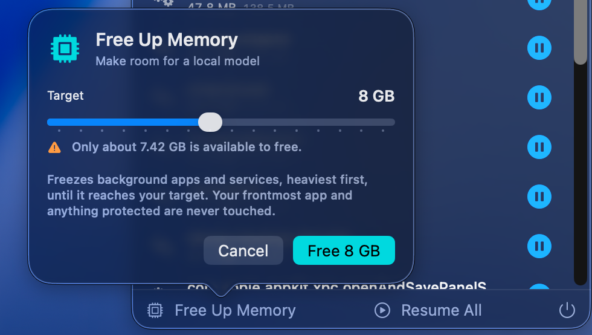
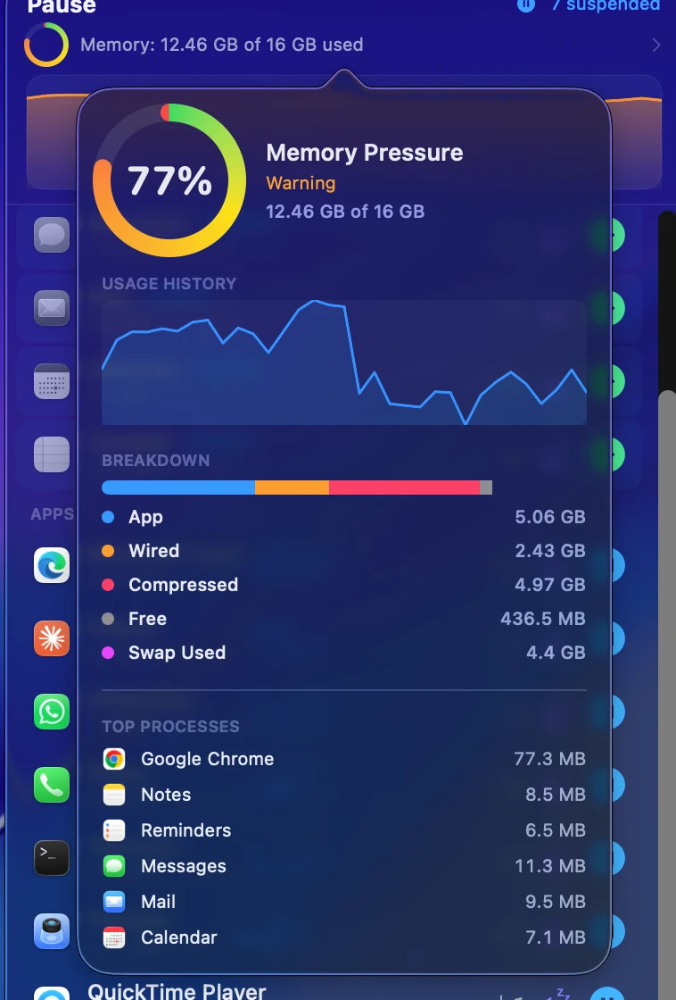
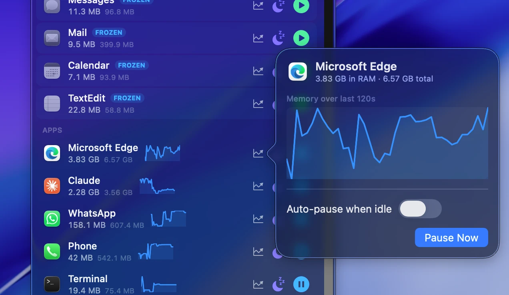
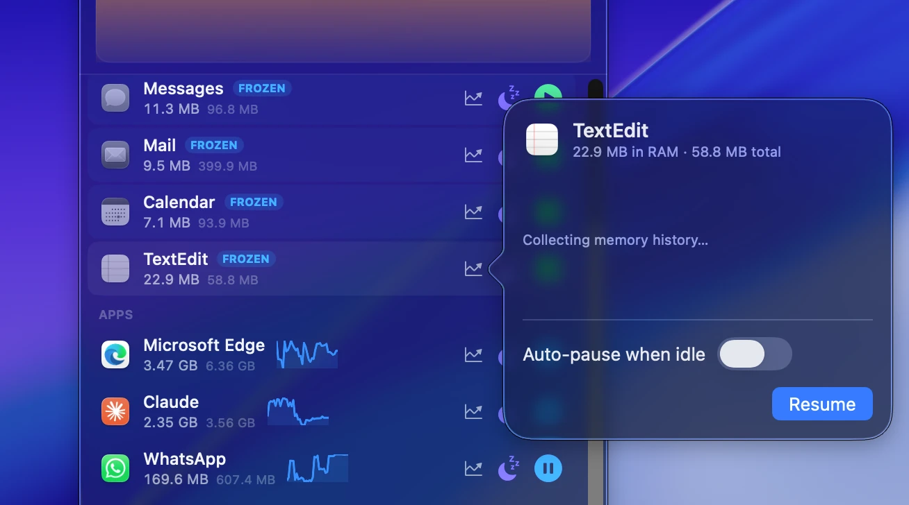

<div align="center">

# Auto Pause Mac Apps

**A 100% free, open-source macOS menu bar app that pauses apps you're not using and gives their RAM back — then resumes them exactly where you left off.**

[](https://github.com/fazalrshah/auto-pause-mac-apps/releases/latest)


</div>

---

## What is Auto Pause Mac Apps?

**Auto Pause Mac Apps** is a free Mac menu bar utility that suspends (freezes) running
applications so macOS can reclaim their memory, and resumes them instantly when you need them
again. It is the Mac equivalent of putting an app in suspended animation: the app stops using
CPU, its RAM becomes reclaimable, and nothing about your session is lost.

It has two levels:

1. **Pause** — freezes the app in place. Resume is instant and byte-perfect.
2. **Deep Sleep** — quits the app while preserving its state, releasing **all** of its memory
   *including swap*. Waking relaunches it and restores your windows and tabs.

It is **100% free**, open source under the MIT license, has no ads, no subscription, no account,
no telemetry, and no paid tier. There is nothing to buy.

---

## Real problems this solves

| Situation | What you do | What you get back |
|---|---|---|
| **Running a local LLM** (Ollama, LM Studio, llama.cpp) and there isn't enough free RAM | Open **Free Up Memory**, set a target of 8 GB, click once | Enough headroom to load the model, then one click to restore everything |
| **Chrome or Edge is eating 6 GB** while you work in another app | Pause the browser | Gigabytes back, every tab exactly where it was when you resume |
| **Claude, Codex, Cursor and Docker all open at once** and your Mac starts swapping | Pause the two you aren't touching | Memory pressure drops out of the red without closing anything |
| **A forgotten `node` or `bun` dev server** is holding hundreds of MB | Freeze it from the Background Services list | RAM back without hunting for the process in Activity Monitor |
| **Adobe, Dropbox and updater daemons** idling in the background | Freeze them | Memory back; unfreeze whenever you actually need them |
| **You're on battery and want it to last** | Pause background apps | They stop consuming CPU entirely, not just "less" |

---

## Screenshots

### The main panel — every app and service, ranked by real memory use


One panel, three sections:

- **Suspended (top)** — Messages, Mail, Calendar and TextEdit are `FROZEN`, each with a green
  button to bring them straight back. They pin to the top so a frozen app is never lost.
- **Apps** — running apps sorted by the RAM they actually hold, each with a live sparkline and
  buttons to Pause (⏸), Deep Sleep (🌙) or open details.
- **Background services** — marked *freeze only*, because quitting a daemon can break sync or
  backups.

Look at the frozen **Mail** row: `9.5 MB` resident against `399.9 MB` footprint. Mail is holding
9.5 MB of real RAM — the other ~390 MB has already been compressed or swapped out. That gap is
exactly what tools showing only Activity Monitor's footprint number hide from you.

The header reads `7 suspended` and `12.47 GB of 16 GB used`, over a live system usage graph.

### Free Up Memory — make room for a local model in one click



Set a target in GB and the app freezes background apps and services heaviest-first until it
reaches it. Your frontmost app and ~30 protected system processes are never touched.

Note the honesty: with 8 GB requested it warns **"Only about 7.42 GB is available to free"**
rather than silently under-delivering. Afterwards, **Restore** puts back precisely the set it
froze — anything you froze by hand stays frozen.

### System dashboard — where your memory actually went



A real pressure gauge with Normal / Warning / Critical thresholds, usage history, and the full
breakdown from `host_statistics64`: **App 5.06 GB · Wired 2.43 GB · Compressed 4.97 GB · Free
436.5 MB · Swap 4.4 GB**.

This view explains why "Memory Used" can look stuck. Nearly 5 GB here is *compressed* — data
macOS has already squeezed to make room. Compressed pages still count as used, so the headline
number stays high even while apps are being frozen and memory is genuinely being reclaimed.

### Per-app detail — memory history and automatic pausing



Every app has a detail view with its resident-vs-total split (**Edge: 3.83 GB in RAM · 6.57 GB
total**), a rolling two-minute memory graph, and **Auto-pause when idle** — freeze this app
automatically after N minutes in the background, thaw it when you come back. Off by default,
set per app.

### Frozen apps stay visible and instantly resumable



A frozen app keeps its row and its numbers — TextEdit sits at **22.9 MB in RAM · 58.8 MB
total** — and one click resumes it exactly where it was. Nothing is closed, nothing is lost.

---

## Install

**[⬇ Download the free DMG →](https://github.com/fazalrshah/auto-pause-mac-apps/releases/latest)**

1. Open the DMG and drag **Auto Pause Mac Apps** into Applications.
2. First launch only: right-click the app → **Open** → confirm.

Step 2 exists because the app is ad-hoc signed rather than notarized — Apple charges $99/year
for notarization and this app is free, so that cost isn't passed on to you. The full source is
here for you to read or build yourself.

Look for the ⏸ icon in your menu bar. There is no Dock icon and no window.

### Build it yourself

Requires only Xcode Command Line Tools — no Xcode install needed.

```bash
git clone https://github.com/fazalrshah/auto-pause-mac-apps.git
cd auto-pause-mac-apps
./build.sh                 # native build
./build.sh --universal     # Apple Silicon + Intel
./package-dmg.sh 1.1.0     # build the DMG
```

---

## Features in detail

### ⏸ Pause — freeze any app instantly

Sends `SIGSTOP` to the app **and every helper process it owns**. CPU use drops to zero and
macOS reclaims the app's resident memory. `SIGCONT` resumes it byte-perfectly — same scroll
position, same undo history, same unsaved text.

*Why the process tree matters:* Chrome's memory isn't in Chrome. It's spread across ~25
`Google Chrome Helper` processes. Freezing only the parent frees almost nothing, which is why
naive "app pauser" scripts don't work on browsers.

### 🌙 Deep Sleep — free everything, including swap

Quits the app the normal way — the same as pressing ⌘Q — so macOS and the app save state
first. This is the only mechanism on macOS that returns **100% of an app's memory, swap
included**. Waking relaunches it and restores your windows and tabs in seconds.

Before the first use it shows a warning explaining exactly what will happen, tells you whether
*that specific app* will restore its windows, and offers to enable window restore for it.

### 🧠 Free Up Memory — the local model button

Set a GB target; the app freezes background apps and services heaviest-first until it's reached.
Your frontmost app and ~30 protected system processes are never touched. It records the exact
set it froze, so **Restore** undoes precisely that and leaves anything you froze by hand alone.

### ⚙️ Background services — memory nothing else surfaces

Enumerates every process owned by your user account, groups stray processes under their parent
service, and lists them with real memory costs: idle dev servers, updater daemons, sync helpers,
speech services. Services are **freeze-only** — quitting a daemon can break sync or backups, and
daemons have no state-restoration contract.

### 📊 Honest memory numbers

Each row shows two figures, and the gap between them is the entire point:

- **Resident** (large) — RAM held *right now*. This is what drops when you pause.
- **Footprint** (dim) — Activity Monitor's "Memory" column, which also counts pages already
  compressed or swapped to disk, so it barely moves even after the RAM is reclaimed.

Measured on a 16 GB M1 with Chrome frozen:

```
Google Chrome — footprint 4.31 GB · resident 275 MB
```

Freezing returned roughly **4 GB of actual RAM** while the footprint number hardly moved. Tools
that display only footprint make pausing look like it did nothing at all.

### ⏱ Auto-pause when idle

Per app, off by default: freeze automatically after N minutes in the background, thaw on return.

---

## FAQ

### Is it really free?

Yes — 100% free, forever. MIT licensed, no ads, no subscription, no account, no telemetry, no
paid upgrade. The complete source is in this repository.

### Will I lose my work?

No. Pause never touches your data — the app is frozen in memory, exactly as it was. Deep Sleep
quits the app the normal way: apps that autosave save first, and apps that don't show their usual
"Do you want to save?" dialog and stay open, in which case the app is left frozen instead.
**Nothing is ever force-quit.** No `SIGKILL`, ever.

### Does it need root, a password, or special permissions?

No. It uses Unix signals and Apple's public `libproc` APIs, which work on processes owned by your
own user account by design. No root, no kernel extension, no entitlements, no accessibility or
automation prompts.

### Does pausing an app actually free RAM?

Yes, but read the *resident* number, not the footprint. On a test machine, freezing Chrome took it
from 4.31 GB footprint to 275 MB resident. If your Mac is heavily oversubscribed, the system-wide
"Memory Used" gauge may not drop, because macOS immediately reuses freed pages for active apps —
that's macOS working correctly. Use Deep Sleep when you need the total to actually fall.

### How is this different from force-quitting an app?

Force-quitting destroys your session — tabs, windows, unsaved work. Pause freezes the app with
everything intact, and Deep Sleep quits it only after state is saved so it comes back as it was.

### Does it work on Apple Silicon (M1/M2/M3/M4) and Intel?

Yes. The release DMG is a universal binary for both. macOS 14 (Sonoma) or later.

### Can I pause Chrome, Edge, Safari, Slack, Docker, or Electron apps?

Yes. Because it freezes the whole process tree, multi-process apps like Chromium browsers and
Electron apps (Slack, VS Code, Discord) are handled correctly — that's where most of the memory
actually lives.

### Which processes will it refuse to touch?

Around 30 critical ones — `WindowServer`, `ControlCenter`, `coreaudiod`, `loginwindow`, `Finder`,
`Dock` and similar. Freezing those would wedge the UI or kill audio, so they're permanently
protected. It also never touches itself or processes owned by other users.

### What happens if the app crashes while things are frozen?

Frozen and sleeping apps are recorded on disk, so they stay listed and resumable next launch.
Quitting the app normally resumes everything automatically.

### Can it snapshot an app to disk and restore it later?

No — and nothing on macOS can. [CRIU](https://github.com/checkpoint-restore/criu) does this on
Linux using `ptrace`, `/proc` and parasite code injection, none of which exist on macOS, and
`task_for_pid` is restricted by SIP. A state-preserving quit (Deep Sleep) is the closest
achievable equivalent.

---

## How it works

| Capability | Mechanism |
|---|---|
| Freeze / resume | `SIGSTOP` / `SIGCONT` across the full process tree |
| Process discovery | `proc_listchildpids`, `proc_listpids` |
| Memory measurement | `proc_pid_rusage` → `ri_resident_size` and `ri_phys_footprint` |
| Frozen-state detection | `proc_pidinfo` → `pbi_status == SSTOP` |
| System memory | `host_statistics64` + `sysctl vm.swapusage` |
| Deep Sleep | `NSRunningApplication.terminate()` + macOS state restoration |
| Wake | `NSWorkspace.openApplication` |

Apple's own guidance is to prefer `libproc` over `task_for_pid()`, which SIP restricts to
development tools. That's why this needs no entitlements and prompts you for nothing.

📖 **[Full architecture — module by module →](docs/ARCHITECTURE.md)**

---

## Known limitations

- A frozen app beachballs if you click it and shows "Not Responding" in Activity Monitor. Expected.
- Don't freeze an app mid-call or mid-upload — network connections will drop.
- Window-restore quality after Deep Sleep varies by app. Browsers use their own "Continue where
  you left off" setting instead of macOS's, and the app checks it for you.

## Contributing

Issues and pull requests welcome. The codebase is small, dependency-free, and
[documented module by module](docs/ARCHITECTURE.md).

## License

MIT — free to use, modify and redistribute. See [LICENSE](LICENSE).
